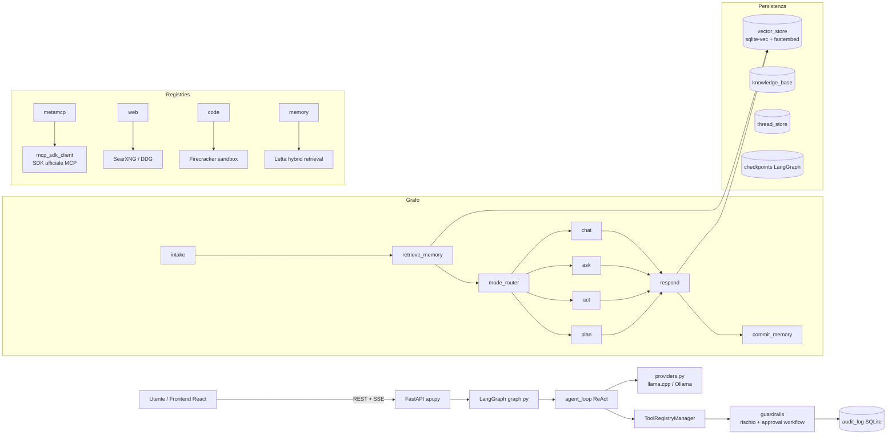
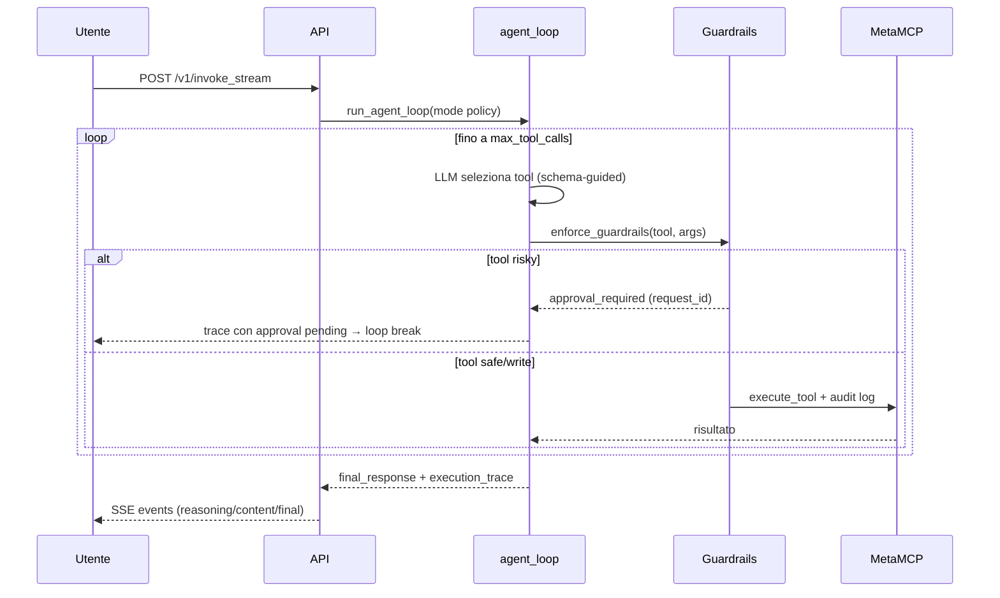

# Home Lab Agent - Backend

Backend LangGraph + FastAPI per l'agente AI del mio homelab.

## Architettura



### Flusso di una richiesta



## Struttura

- `main.py`: CLI entry point
- `graph.py`: grafo LangGraph (intake → retrieve_memory → mode_router → chat/ask/act/plan → respond → commit_memory)
- `agent_loop.py`: loop ReAct custom con cache dedup e parallel calls read-only
- `providers.py`: astrazione LLM multi-provider (llama.cpp OpenAI-compat, Ollama)
- `mcp_sdk_client.py`: client MCP basato sull'SDK ufficiale (sessione persistente, retry)
- `mcp_client.py`: client legacy SSE/REST (fallback)
- `registry/`: registries dei tool (`metamcp`, `web`, `code`, `memory`)
- `guardrails.py`: classificazione rischio tool, shell guard, approval workflow
- `audit_log.py`: audit persistente di ogni tool call
- `vector_store.py`: memoria semantica (sqlite-vec cosine + fastembed locale)
- `knowledge_base.py`: KB documentale (.md/.txt/.pdf) con chunking
- `letta_client.py`: client Letta (memoria conversazionale + hybrid retrieval BM25+RRF)
- `router.py`: mode router neurale (chat/ask/act/plan)
- `mode_policy.py`: policy per mode (tool calls, registries, reasoning budget)
- `config.py`: Pydantic Settings (.env) con fail-fast sicurezza
- `api.py`: API REST FastAPI
- `schemas.py`: modelli Pydantic
- `run_api.py`: entry point uvicorn

## Installazione

```bash
python3 -m venv .venv
source .venv/bin/activate
pip install -r requirements.txt
```

## Configurazione

Copia `.env.example` in `.env` e compila:
```
METAMCP_URL=http://192.168.1.175:12008/metamcp/MetaMCP/sse
METAMCP_API_KEY=<tua_api_key>
LLAMA_CPP_URL=http://192.168.1.159:8080/v1
DEFAULT_MODEL=qwen-3.6-35b-hugectx
LETTA_URL=http://192.168.1.177:8083
LETTA_API_KEY=<tua_api_key>
CHECKPOINT_DB_PATH=/opt/main-agent/checkpoints.db
API_SECRET_KEY=<opzionale, per auth API>
```

## Avvio

### CLI
```bash
.venv/bin/python3 main.py "task" --thread alice
```

### API REST
```bash
.venv/bin/python3 run_api.py
```

### Systemd (produzione)
```bash
sudo systemctl start main-agent-api
sudo systemctl enable main-agent-api
```

## Test

```bash
# Test unitari e integrazione (env isolate via conftest.py)
pytest test_guardrails.py test_memory_rag.py test_api_integration.py -v

# Lint
ruff check .
```

Nota: i vecchi test `test_dynamic_tool_selection.py`, `test_phase4.py`, `test_rollback.py`,
`test_modes_and_registries.py`, `test_agent_verification.py`, `test_conversation_length.py`
richiedono servizi reali (LLM, MetaMCP) e non fanno parte della suite CI.

## Docker Compose (dev)

```bash
cd homelab-agent
docker compose -f docker-compose.dev.yml up --build
# Backend: http://localhost:8090/v1 — Frontend: http://localhost:5173
```

## Deploy con Docker (produzione)

Lo stack prod usa `docker-compose.prod.yml`: backend FastAPI + frontend compilato e servito da nginx (con proxy `/v1/` e SSE senza buffering).

```bash
# 1. Clona il repo e configura l'ambiente
cd homelab-agent
cp backend/.env.example backend/.env
# modifica backend/.env con i tuoi valori (API_SECRET_KEY, CORS_ORIGINS, URL servizi...)

# 2. Build e avvio
docker compose -f docker-compose.prod.yml up -d --build

# 3. Verifica
curl http://localhost:8090/v1/health          # {"status":"ok"}
curl http://localhost/                        # frontend UI
```

Il frontend nginx espone la porta 80 e inoltra `/v1/` al backend (nome servizio compose `backend`, porta interna 8090). Per HTTPS metti un reverse proxy davanti (es. Nginx Proxy Manager) puntando alla porta 80 del container frontend.

**Importante**: se accedi all'UI tramite un dominio proxato, aggiungi quell'origine (con schema) a `CORS_ORIGINS` nel `backend/.env`, altrimenti il browser bloccherà le chiamate API con "Disallowed CORS origin".

## Endpoint principali

| Metodo | Path | Descrizione |
|---|---|---|
| GET | `/v1/health` | Health check (pubblico) |
| GET | `/v1/status` | Health aggregato llama.cpp/MetaMCP/Letta |
| POST | `/v1/chat\|ask\|act\|plan\|invoke` | Chat sincrona per mode |
| POST | `/v1/invoke_stream` | Chat streaming SSE |
| GET/DELETE | `/v1/threads[/{id}]` | Gestione thread |
| GET | `/v1/audit` | Audit log tool call |
| GET | `/v1/approvals` | Approvazioni pending |
| POST | `/v1/approvals/{id}/approve\|deny` | Risolvi approvazione |
| GET/POST | `/v1/kb/documents` | Lista/upload documenti KB |
| DELETE | `/v1/kb/documents/{filename}` | Elimina documento |
| GET | `/v1/kb/search` | Ricerca semantica KB |

## Sicurezza

- `API_SECRET_KEY`: se impostata, tutti gli endpoint (tranne health) richiedono header `X-API-Key`. Se manca, il backend **non parte** a meno di `ALLOW_INSECURE=1`.
- Guardrail: tool rischiosi (delete/rollback/exec_*) richiedono approvazione utente; comandi shell pericolosi sono sempre bloccati.
- CORS ristretto a `CORS_ORIGINS`; rate limiting su endpoint chat (`RATE_LIMIT`, default 30/min).

curl http://localhost:8090/v1/health
