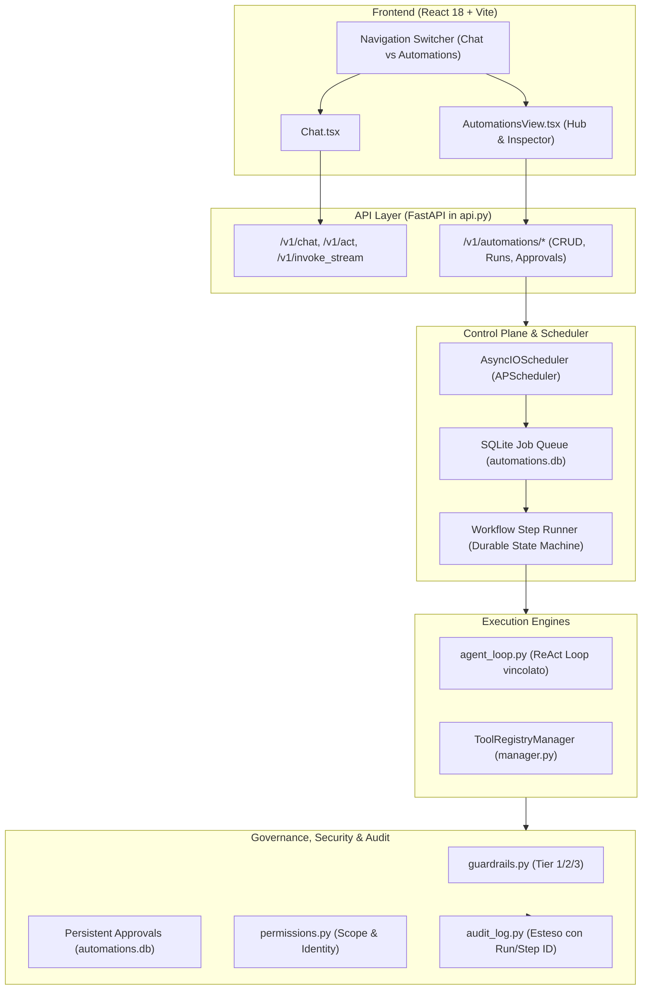
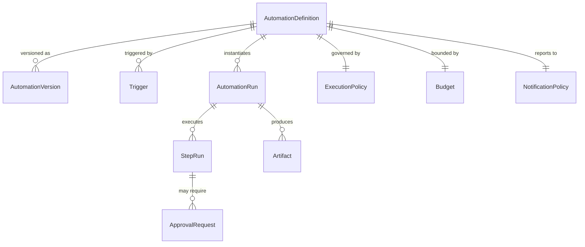
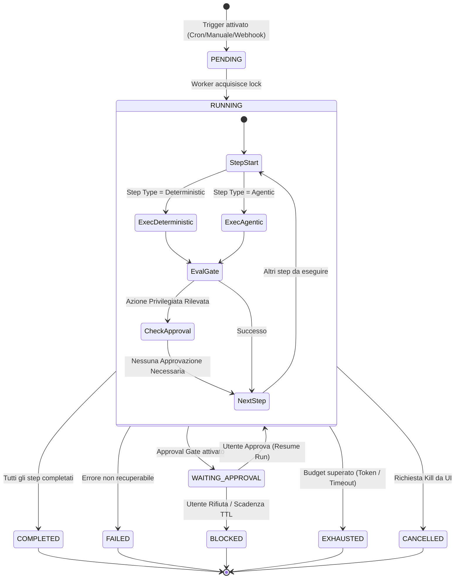
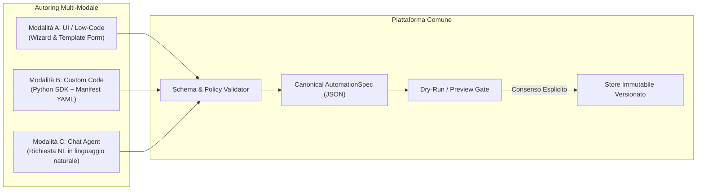

# Architettura di Sistema — Automations & Loops
**Progetto:** `homelab-agent`  
**Area:** Automations, Scheduled Routines & Task-Oriented Loops  
**Stato:** Architectural Baseline (Approvato per Implementazione)  
**Data:** Settembre 2026

---

## 1. Visione e Obiettivi

La piattaforma `homelab-agent` è nata come assistente conversazionale reattivo (*utente $\rightarrow$ chat $\rightarrow$ agent $\rightarrow$ tool $\rightarrow$ risposta*). L'area **Automations & Loops** estende la piattaforma con un motore di esecuzione autonomo, deterministico e guidato da policy:

```
Trigger / Evento ──► Automation Run ──► Workflow Steps (Deter/Agentic) ──► Outcome / Approval
```

### Principi Guida Fondamentali
1. **Unico Modello Canonico (`AutomationSpec`)**: Nessuna frammentazione. Le automazioni create da UI (form/template), da codice custom (Python SDK) o generate dall'agente in chat convergono sullo stesso schema dichiarativo serializzabile.
2. **Durabilità e Resilienza**: Le run possono attendere approvazioni umane per ore o giorni, sopravvivere al riavvio dei container/host e non dipendono da connessioni HTTP persistenti.
3. **Separazione tra Deterministico e Agentico**: Il Modello Linguistico (LLM) è impiegato per classificazione, estrazione, sintesi e selezioni complesse, ma **non è mai la fonte di verità** per la verifica dei test, la sicurezza dei comandi shell, la gestione dei secret o le condizioni di stop dei loop.
4. **Sicurezza Homelab-First & Least-Privilege**: Ogni automazione opera con una specifica *Execution Identity* (Service Account), con target allowlist (host, container, repository, destinatari) e tool catalog perimetrati. Le azioni mutanti richiedono policy esplicite o approvazione umana.

---

## 2. Analisi dell'Architettura Attuale e Integrazione

La piattaforma esistente sul branch `dev` fornisce componenti solidi che vengono riutilizzati ed estesi:



### Componenti Esistenti Coinvolti
- **[backend/guardrails.py](file:///home/deggio/Desktop/coding/progetti/homelab/homelab-agent/backend/guardrails.py)**: Fornisce la classificazione a 3 Tier (`CRITICAL_BLOCKED_PATTERNS`, `SUSPICIOUS_HIGH_RISK_PATTERNS`, `VIEW_TOOLS`). Viene integrato con lo storage persistente delle approvazioni su DB invece dell'effimero `_APPROVALS` in memoria RAM.
- **[backend/registry/manager.py](file:///home/deggio/Desktop/coding/progetti/homelab/homelab-agent/backend/registry/manager.py)**: Dispatcher unificato di tutti i tool (`metamcp`, `web`, `code`, `memory`, `vision`). Gli step deterministici invocano direttamente i registry.
- **[backend/agent_loop.py](file:///home/deggio/Desktop/coding/progetti/homelab/homelab-agent/backend/agent_loop.py)**: Loop ReAct per gli step agentici, configurato con policy restrittive perimetrate sull'automazione.
- **[backend/audit_log.py](file:///home/deggio/Desktop/coding/progetti/homelab/homelab-agent/backend/audit_log.py)**: Registro persistente di ogni chiamata tool, arricchito con `run_id`, `step_run_id` e `automation_id`.

---

## 3. Modello di Dominio (Domain Model)

Tutte le entità sono modellate tramite **Pydantic v2** e persistite in tabelle SQLite dedicate (`/data/automations.db`):



### Entità Chiave
1. **`AutomationDefinition`**: La definizione master (nome, descrizione, versione, abilitazione, spec workflow, policy, budget).
2. **`Trigger`**: Configurazione temporale (`cron`), evento esterno (`webhook`), manuale (`manual`) o interno (`event`).
3. **`WorkflowSpec` & `WorkflowStepDefinition`**: La sequenza ordinata di step. Ogni step può essere:
   - `deterministic_action`: esecuzione diretta di un tool o script sandboxed.
   - `agentic_task`: invocazione LLM guidata da prompt e catalogo tool ristretto.
   - `approval_gate`: punto di controllo esplicito che richiede autorizzazione umana prima di procedere.
   - `evaluation_gate`: test, lint, asserzioni o validazioni di schema.
4. **`ExecutionPolicy`**: Identity dedicata, tool allowlist, target allowlist (container ammessi, repository ammesse, destinatari email autorizzati), modalità di sicurezza (`safest`, `normal`, `dangerous`).
5. **`Budget`**: Limiti di sicurezza: `max_duration_seconds`, `max_llm_calls`, `max_tool_calls`, `max_tokens`, `max_retries_per_step`.
6. **`AutomationRun`**: Istanza di esecuzione di un'automazione, con `run_id` univoco, stato (`PENDING`, `RUNNING`, `WAITING_APPROVAL`, `COMPLETED`, `FAILED`, `CANCELLED`, `EXHAUSTED`), payload iniziale e traccia di esecuzione.
7. **`StepRun`**: Esecuzione di un singolo passaggio, con input, output, consumi token, durata e traccia dei tool.
8. **`Artifact`**: File generati dall'automazione (report Markdown, patch diff `.patch`, file di configurazione, riassunti JSON) archiviati in `/data/artifacts`.
9. **`ApprovalRequest`**: Richiesta persistente di approvazione per azioni privilegiate o mutanti, associata a `run_id` e `step_run_id`.

---

## 4. Runtime & State Machine

Il ciclo di vita di una `AutomationRun` è governato da una macchina a stati finiti deterministica:



### Meccanismo di Pause & Resume
1. Quando uno step richiede un'azione mutante o un tool non pre-approvato:
   - Viene creato un record in `automation_approvals` sul database SQLite.
   - La `AutomationRun` passa allo stato `WAITING_APPROVAL`.
   - Il worker rilascia la risorsa; nessun thread di sistema rimane occupato in attesa passiva.
   - Viene emessa una notifica verso il frontend e registrato un evento nell'Approvals Inbox.
2. Quando l'utente approva l'azione via UI (`POST /v1/automations/runs/{run_id}/approvals/{approval_id}/resolve`):
   - Lo stato dell'approvazione diventa `approved`.
   - La run viene ricaricata dal database e ripresa esattamente dall'ultimo checkpoint memorizzato in `step_runs`.
   - L'azione autorizzata viene eseguita e il workflow prosegue al passaggio successivo.

### Idempotenza e Prevenzione Duplicazioni
- **Run Idempotency**: Chiave calcolata come `sha256(automation_id + "_" + bucket_temporale)` (es. `daily-email_2026-09-18_08:30`). Se una run con la stessa chiave è già presente in stato `PENDING`, `RUNNING` o `COMPLETED`, il trigger duplicato viene scartato.
- **Step Idempotency**: Ogni azione con effetti esterni (es. creazione bozza, apertura PR) genera una chiave univoca di step per prevenire esecuzioni multiple in caso di retry.

---

## 5. Modelli di Authoring (Modalità A, B, C)



1. **Modalità A (UI / Low-Code)**: Form guidato con parametri tipizzati e selezione da galleria template. Genera direttamente la struttura `AutomationDefinition`.
2. **Modalità B (Codice Custom)**: Script Python accompagnato da `manifest.yaml`. Utilizza un SDK isolato (`from homelab_agent.sdk import workflow, step, AutomationContext`) con accesso limitato a secret dichiarati e runtime sandboxed.
3. **Modalità C (Conversazione con l'Agente)**: L'utente esprime la richiesta in chat. L'agente genera una proposta strutturata presentata in una card UI con anteprima di trigger, permessi, budget e pulsante di *Dry-Run*. L'automazione viene salvata e attivata **solo previa esplicita conferma dell'utente** (divieto categorico di auto-pubblicazione autonoma).

---

## 6. Architettura di Sicurezza & Threat Modeling

| Vettore di Rischio | Meccanismo di Difesa |
| :--- | :--- |
| **Indirect Prompt Injection** (email o issue esterne) | Incapsulamento dell'input con delimitatori di sicurezza (`GUARD_OPEN` / `GUARD_CLOSE`), policy untrusted-context e gating deterministico non scavalcabile dal prompt. |
| **Tool Poisoning / Server MCP Non Fidati** | Tool Allowlist rigida definita nell'`ExecutionPolicy`. Tool non inclusi nella whitelist vengono respinti a monte. |
| **Privilege Escalation tra Automazioni** | `ExecutionIdentity` (Service Account) isolata per ciascuna automazione; i permessi non sono ereditati dall'utente root. |
| **Esfiltrazione di Credenziali e Secret** | Scoping selettivo dei secret (`secrets_whitelist`); filtro di redaction su tutti i log e sugli artefatti generati. |
| **Loop Infiniti e Consumo Risorse Fuori Controllo** | Circuit breaker con hard limit: `max_duration_seconds`, `max_tokens` e `max_tool_calls` enforced dallo step runner. |
| **Esecuzione Codice Arbitrario su Host** | Sandboxing obbligatorio per step di codice custom (Firecracker MicroVM o container isolati con limiti cgroups); fallback locale con privilegi elevati categoricamente vietato. |

---

## 7. Storage e Persistenza su File System

Tutti i dati dell'area Automations risiedono nel volume persistente `/data`:
- Database SQLite dedicato: `/data/automations.db` (in modalità WAL).
- Storage degli artefatti: `/data/artifacts/<run_id>/<filename>`.
- Directory per automazioni custom: `/data/custom_automations/<automation_id>/`.
