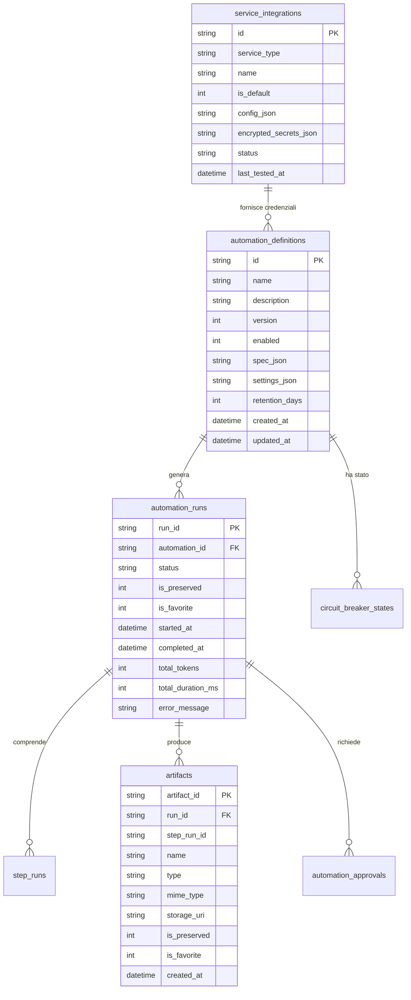
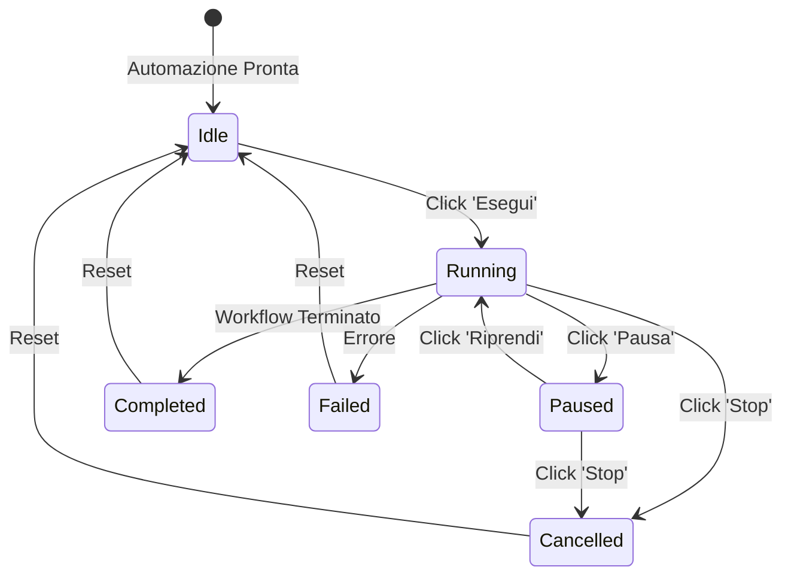

# Specifiche Architetturali — Automations & Loops v2

**Progetto:** `homelab-agent`  
**Versione:** 2.0.0  
**Data di Redazione:** 21 Settembre 2026  
**Autore:** Antigravity Pairing Agent & System Architecture

---

## 1. Visione d'Insieme & Obiettivi

La versione v2 del sottosistema **Automations & Loops** evolve la piattaforma da un orchestratore di step a un vero **ecosistema di automazione resiliente e user-friendly**, colmando i gap operativi riscontrati durante l'utilizzo reale:
1. **Artefatti come Cittadini di Prima Classe (First-Class Citizens)**: Separazione degli output e report dallo storico delle run, con interfaccia dedicata a tutto schermo, raggruppamento temporale ("Oggi", "Ieri", "Ultimi 7 giorni", "Questo Mese"), ricerca full-text, visualizzatore Markdown ad alta leggibilità e accesso a 1-click dalla card dell'automazione.
2. **Ciclo di Vita delle Run & Retention Intelligente**: Eliminazione puntuale e massiva delle esecuzioni (es. pulizia fallite), policy di retention configurabile con TTL automatico, salvaguardia da auto-eliminazione tramite lucchetto *"Preserve"* e preferiti con stellina *"Star"*.
3. **Card Dinamiche & Controllo Real-Time dell'Esecuzione**: Feedback visivo immediato di esecuzione (bordo pulsante e bagliore dinamico), transizione del pulsante *Esegui* in *Pausa* e successivamente in *Riprendi*, pulsante *Stop* per annullare la run attiva, drawer espandibile con pipeline visuale e pillola di accesso diretto all'ultimo report generato.
4. **Parametri Tipizzati & Architettura Integrazioni su 3 Livelli**:
   - **Parser Automatico delle Variabili**: Introspezione di prompt, parametri e codice Python per identificare variabili attese (`{{inputs.X}}`, `{{secrets.Y}}`, `os.environ["Z"]`), con deduzione automatica del tipo e supporto all'aggiunta libera di parametri manuali.
   - **Integrazioni Globali (Livello 1)**: Credenziali base condivise (es. account IMAP principale, GitHub PAT, Home Assistant).
   - **Override Automation-Specific & Multi-Account (Livello 2)**: Scheda impostazioni dedicata per ogni automazione, che permette di scegliere tra l'account globale predefinito o credenziali alternative/multiple.
   - **Servizi Dinamici & Ad-Hoc (Livello 3)**: Supporto a integrazioni arbitrarie non previste nativamente, senza richiedere migrazioni DB.
   - **Iniezione del Contesto all'Agente (Context Grounding)**: Il modello riceve informazioni puntuali sulle integrazioni attive, evitando allucinazioni in fase di generazione.
5. **Harness Tollerante & Validatore Pre-Flight**: Protezione attiva per modelli compatti/self-hosted con normalizzazione asimmetrica (`arguments`, `args`, `params`, `parameters`), mappatura flessibile dei tipi di step (`agent_task` -> `agentic_task`) e validazione pre-flight prima del salvataggio.

---

## 2. Architettura del Database (`automations.db`)

Trattandosi di un ambiente in fase di sviluppo attivo (CT 125, branch `dev`), l'architettura persegue una **progettazione canonica e pulita, priva di debito tecnico o shim legacy di retrocompatibilità**. Lo schema SQLite (in modalità WAL con `busy_timeout = 30000`) adotta direttamente la struttura ideale per supportare nativamente le nuove funzionalità:



### 2.1 Modifiche allo Schema Relazionale

1. **Tabella `automation_runs`**:
   - `is_preserved INTEGER NOT NULL DEFAULT 0`: Flag di protezione dalla retention automatica.
   - `is_favorite INTEGER NOT NULL DEFAULT 0`: Contrassegno di preferito / star per filtraggio rapido.
2. **Tabella `artifacts`**:
   - `is_preserved INTEGER NOT NULL DEFAULT 0`: Se impostato, il file su disco e il record DB non vengono mai eliminati dalla retention.
   - `is_favorite INTEGER NOT NULL DEFAULT 0`: Preferito / segnalibro.
3. **Tabella `automation_definitions`**:
   - `retention_days INTEGER DEFAULT NULL`: Giorni di retention specifici per l'automazione (sovrascrive il default globale di 14 giorni).
   - `settings_json TEXT DEFAULT '{}'`: Impostazioni personalizzate dedicate (es. override integrazioni, mapping account, parametri avanzati).
4. **Tabella `service_integrations`**:
   - `is_default INTEGER NOT NULL DEFAULT 1`: Identifica l'integrazione base predefinita per il tipo di servizio.

---

## 3. Gestione Artefatti & Nuova Sezione UI

### 3.1 Progettazione API REST

| Metodo | Endpoint | Descrizione |
| :--- | :--- | :--- |
| `GET` | `/v1/automations/artifacts` | Elenco paginato di tutti gli artefatti con filtri (`automation_id`, `type`, `search`, `starred_only`, `preserved_only`, `limit`, `offset`). |
| `GET` | `/v1/automations/{id}/latest-artifact` | Restituisce il contenuto e i metadati dell'ultimo artefatto generato da una specifica automazione. |
| `PATCH` | `/v1/automations/artifacts/{artifact_id}/favorite` | Toggle dello stato preferito (`is_favorite`). |
| `PATCH` | `/v1/automations/artifacts/{artifact_id}/preserve` | Toggle del lucchetto di conservazione (`is_preserved`). |
| `DELETE` | `/v1/automations/artifacts/{artifact_id}` | Eliminazione definitiva dell'artefatto dal DB e dal filesystem (`storage_uri`). |

### 3.2 Layout & User Experience Frontend

La scheda **"Artefatti & Report"** viene introdotta come nuova tab primaria in `AutomationsView.tsx` (accanto ad *Automazioni*, *Storico Run*, *Approvazioni*, *Template*, *Integrazioni*), con un layout master-detail a 2 colonne:

```
+----------------------------------------------------------------------------------------------------+
| Filtri: [ Cerca nei report... ]  [ Automazione: Tutte v ]  [ Tipo: Tutti v ]  [ ⭐ Solo Preferiti ] |
+------------------------------------+---------------------------------------------------------------+
| LISTA ARTEFATTI (Master)           | ANTEPRIMA & DETTAGLIO ARTEFATTO (Detail)                     |
|                                    |                                                               |
| OGGI                               | Daily AI Papers Briefing — 21 Settembre 2026                 |
| [⭐] [🔒] Daily AI Papers (15:57)   | Generato da: ai-paper-daily-briefing (Run: run_d2e0b3345e05)  |
|      Report Markdown • 14.2 KB     | [ 📋 Copia MD ] [ ⬇️ Scarica ] [ ↗️ Vai alla Run ] [ 🗑️ ]    |
| [⭐] [  ] GitHub Trending (12:00)   | ------------------------------------------------------------- |
|      Report Markdown • 6.8 KB      | # 📰 Daily AI Papers Briefing — 21 Settembre 2026             |
|                                    |                                                               |
| IERI                               | ## 1. Abstract & Trend di Giornata                            |
| [  ] [🔒] Daily AI Papers (14:26)   | L'analisi odierna evidenzia una concentrazione di lavori su...|
|                                    |                                                               |
| ULTIMI 7 GIORNI                    | ### [1] DeepSeek-V3 Architecture Overview                     |
| [  ] [  ] Email Briefing (18 Set)  | - **Autori**: Research Team et al.                            |
|      Report • 3.4 KB               | - **Contributo**: Ottimizzazione Multi-Head Latent Attention..|
+------------------------------------+---------------------------------------------------------------+
```

- **Raggruppamento Temporale Intelligente**: Gli artefatti vengono suddivisi visivamente in bucket temporali dinamici:
  - *Oggi*
  - *Ieri*
  - *Ultimi 7 Giorni*
  - *Questo Mese*
  - *Meno Recenti*
- **Visualizzatore Markdown di Qualità Superiore**:
  - Rendering Markdown completo (headers, liste, tabelle con bordi curati, alert GitHub, sintassi evidenziata dei blocchi di codice).
  - Azioni rapide in testata: *Copia Markdown negli appunti*, *Download del file originale*, *Link diretto alla Run di origine*, *Elimina*.
  - Metadati espandibili in calce: Path storage, SHA256 checksum, dimensione e timestamp preciso in formato ISO locale.
- **Accesso Rapido a 1-Click dalla Card dell'Automazione**:
  - Ogni card nella dashboard principale mostra il badge *"Ultimo Report"* (es. `21 Set, 15:57`). Cliccando sul badge, l'utente viene indirizzato direttamente all'anteprima dell'artefatto nella tab dedicata, senza dover navigare nello storico delle run.

---

## 4. Ciclo di Vita delle Run, Eliminazione & Retention

### 4.1 Meccanismo di Deletion Puntuale e Massiva

- **Eliminazione Singola**: `DELETE /v1/automations/runs/{run_id}`:
  - Rimuove a cascata la riga `automation_runs`, i relativi `step_runs`, `automation_approvals` e `artifacts`.
  - Se la run è marcata come `is_preserved = 1`, l'eliminazione viene rifiutata a meno che non sia specificato il parametro `force=true`.
  - Rimuove dal disco i file fisici degli artefatti associati.
- **Eliminazione Massiva (Bulk Cleanup)**: `DELETE /v1/automations/runs`:
  - Supporta parametri di query mirati:
    - `failed_only=true`: Cancella tutte le run con stato `FAILED`, `CANCELLED` o `EXHAUSTED` (fondamentale per pulire i test falliti).
    - `automation_id=...`: Pulisce solo le run di una specifica automazione.
    - `before_date=...`: Elimina run antecedenti a una certa data.
  - **Preservazione Garantita**: Tutte le run con `is_preserved = 1` o `is_favorite = 1` vengono categoricamente saltate durante le pulizie massive.

### 4.2 Scheduler di Retention Automatica

- Viene configurato un job periodico notturno in APScheduler (`cleanup_expired_runs`):
  - Calcola la finestra di scadenza: `scadenza = now() - timedelta(days=retention_days)`.
  - `retention_days` predefinito: **14 giorni** (configurabile in `config.py` con fallback da env).
  - Se una specifica automazione ha `retention_days` definito nel suo modello, viene applicato il suo valore specifico.
  - La query esegue:
    ```sql
    DELETE FROM automation_runs
    WHERE started_at < :scadenza
      AND is_preserved = 0
      AND is_favorite = 0;
    ```
  - Viene registrato un evento di audit sintetico con il numero di run e artefatti epurati.

---

## 5. Card Automazioni Dinamiche & Controlli Real-Time

### 5.1 Feedback Visivo di Esecuzione

Quando un'automazione entra in stato `RUNNING`:
1. **Bordo e Alone Dinamico**: La card applica classi CSS animate (`border-accent shadow-[0_0_20px_rgba(59,130,246,0.25)] ring-1 ring-accent/50 animate-pulse`).
2. **Badge di Stato in Tempo Reale**: Accanto al titolo appare il badge lampeggiante `● In esecuzione...` con timer di durata trascorso.
3. **Aggiornamento Reattivo**: Il polling / SSE del frontend sincronizza lo stato in tempo reale.

### 5.2 Macchina a Stati dei Pulsanti di Controllo



- **Comportamento del Pulsante Principale**:
  - Quando lo stato è `IDLE` (nessuna run attiva): Mostra **"Esegui"** (icona Play).
  - Quando lo stato è `RUNNING`: Si trasforma immediatamente in **"Pausa"** (icona Pause, colore ambra).
  - Quando lo stato è `PAUSED`: Si trasforma in **"Riprendi"** (icona Play, colore smeraldo).
- **Pulsante di "Stop" (Annullamento Immediato)**:
  - Visibile solo quando l'automazione è in esecuzione o in pausa.
  - Invia `POST /v1/automations/runs/{run_id}/cancel`, arrestando il runner prima del passaggio allo step successivo o interrompendo il processo in corso.

### 5.3 Implementazione nel Runner: Cooperative Pause & Cancellation

Nel loop principale di `backend/automations/runner.py`:
- All'inizio di ogni iterazione di step, il runner interroga lo stato della run sul DB:
  ```python
  current_run = auto_db.get_run(run_id, db_path=self.db_path)
  if current_run["status"] == RunStatus.PAUSED.value:
      logger.info(f"Run '{run_id}' congelata in PAUSA allo step '{current_step_id}'.")
      return AutomationRun(**current_run)
  if current_run["status"] == RunStatus.CANCELLED.value:
      logger.info(f"Run '{run_id}' annullata dall'utente.")
      return AutomationRun(**current_run)
  ```
- Alla ripresa (`resume`), il runner viene richiamato con lo stesso `run_id`: poiché gli step già completati sono memorizzati su `step_runs`, il runner riprende esattamente dallo step interrotto senza rieseguire il lavoro passato.

### 5.4 Contenuto Espandibile della Card (Drawer / Accordion)

La card viene arricchita con una sezione espandibile a comparsa ("Dettagli & Pipeline"):
- **Pipeline Visuale degli Step**: Mini diagramma a nodi orizzontale (`[Cerca Web] ➔ [Sintesi LLM] ➔ [Salva Report]`).
- **Indicatori di Affidabilità**: Success rate percentuale, durata media, e una sequenza di pallini di stato per le ultime 5 esecuzioni (`🟢 🟢 🟢 🔴 🟢`).
- **Pillola Ultimo Artefatto**: Cliccabile, con icona documento e data, per visualizzare il report all'istante.
- **Scorciatoie**: Link diretto a *"Storico Filtrato"* per quella specifica automazione.

---

## 6. Parametri Tipizzati & Architettura Integrazioni Modulari

### 6.1 Parser Automatico di Variabili (Introspection Engine)

Per evitare configurazioni manuali cieche, viene introdotto il modulo `backend/automations/introspection.py`:
- Esegue la scansione statica della definizione dell'automazione analizzando:
  1. Espressioni nei template dei prompt: `{{inputs.NOME}}`, `{{config.NOME}}`, `{{secrets.NOME}}`.
  2. Argomenti dei tool deterministici contenenti stringhe con template.
  3. Codice sorgente Python nei passaggi di tipo `CUSTOM_CODE` (tramite analisi AST o regex per `os.environ.get("NOME")`, `inputs["NOME"]`, `params.get("NOME")`).
- Produce un dizionario strutturato delle variabili richieste:
  ```json
  [
    {
      "key": "arxiv_query",
      "type": "string",
      "label": "Query di ricerca ArXiv",
      "description": "Filtro categorie o keyword (es. cat:cs.AI)",
      "default": "cat:cs.AI OR cat:cs.LG",
      "required": true,
      "source": "prompt_template"
    },
    {
      "key": "max_results",
      "type": "number",
      "label": "Numero Massimo Articoli",
      "description": "Limite di paper da recuperare",
      "default": 10,
      "required": false,
      "source": "tool_parameters"
    }
  ]
  ```
- Nella modale **Parametri** del frontend, l'utente trova:
  - La lista delle **variabili identificate dal parser**, visualizzate con campi di input dedicati (stringa, numero, toggle booleano, selettore o secret mascherato).
  - La sezione per **aggiungere ulteriori parametri personalizzati** arbitrari chiave-valore.

### 6.2 Architettura Integrazioni su Tre Livelli

```
+-----------------------------------------------------------------------------------+
| LIVELLO 1: INTEGRAZIONI GLOBALI BASE                                               |
| - Hub centralizzato ('Integrazioni & Servizi')                                    |
| - Account IMAP principale (es. pve-alerts@homelab.local)                          |
| - GitHub Personal Access Token primario                                           |
| - Istanza Home Assistant primaria (http://192.168.1.69:8123)                      |
| -> Cifratura AES (Fernet), archiviazione in 'service_integrations' (is_default=1) |
+-----------------------------------------+-----------------------------------------+
                                          |
                                          v
+-----------------------------------------------------------------------------------+
| LIVELLO 2: OVERRIDE & MULTI-ACCOUNT PER SINGOLA AUTOMAZIONE                       |
| - Ogni automazione dispone di un pannello 'Impostazioni & Servizi' dedicato       |
| - Selezione Account:                                                              |
|   (o) Usa account globale predefinito                                             |
|   ( ) Usa account alternativo (es. 'email_newsletter', token GitHub secondario)   |
| - Memorizzazione in 'definition.settings_json' con override cifrati o referenze   |
+-----------------------------------------+-----------------------------------------+
                                          |
                                          v
+-----------------------------------------------------------------------------------+
| LIVELLO 3: SERVIZI DINAMICI & AD-HOC (Modellati dall'Agente o dall'Utente)        |
| - Integrazioni non previste nativamente nello schema rigido                       |
|   (es. Telegram Bot Token, Discord Webhook, API Key Tavily, Jira Token)           |
| - L'agente o l'utente può dichiarare uno schema di impostazioni personalizzato    |
|   all'interno dell'automazione, che genera dinamicamente il form di input         |
| - Iniezione trasparente nel runtime tramite variabili d'ambiente o secrets        |
+-----------------------------------------------------------------------------------+
```

### 6.3 Equilibrio Piattaforma vs. Autonomia dei Modelli (SOTA 2026)

Con modelli compatti (8B–14B parametrizzati) in self-hosting:
- **Cosa NON delegare all'LLM**: La gestione a basso livello della crittografia, il binding delle porte di rete, la sintassi grezza del database o la formattazione non validata degli schemi.
- **Cosa DELEGARE all'LLM**:
  1. La selezione degli step logici e la sequenzialità del workflow.
  2. La scrittura di prompt specializzati per i passaggi agentici.
  3. La redazione di script Python ad-hoc per task computazionali o parsing specifico (eseguiti in sandbox sicura con `run_sandboxed_code`).
  4. La dichiarazione dei requisiti del servizio (es. *"Questa automazione richiede un token Telegram e un chat ID"*).
- **Ruolo della Piattaforma (The Harness)**:
  - Fornisce il **contratto chiaro (Schema Contract)** con validazione rigorosa prima dell'esecuzione.
  - Inietta nel contesto dell'agente quali servizi sono già connessi e pronti all'uso.
  - Se un servizio manca, la piattaforma guida l'utente a configurarlo tramite interfaccia protetta senza esporre mai i segreti nel testo della chat.

---

## 7. Robustezza dell'Harness & Normalizzazione Asimmetrica

Per eliminare alla radice i fallimenti riscontrati nei test di creazione autonoma (come il caso *GitHub Trending*):

### 7.1 Miglioramenti a `normalize_proposal`

In `backend/automations/models.py`:
1. **Normalizzazione Parametri Multi-Nome**:
   Riconoscimento automatico di:
   ```python
   raw_params = (
       s.get("parameters") or s.get("arguments") or
       s.get("args") or s.get("params") or {}
   )
   ```
2. **Determinazione Resiliente di `initial_step_id`**:
   Se il workflow è fornito come array di step:
   ```python
   first_step = steps[0] if (steps and isinstance(steps[0], dict)) else {}
   initial_id = (
       d.get("workflow", {}).get("initial_step_id") or
       first_step.get("step_id") or
       first_step.get("id") or
       "step_1"
   )
   ```
3. **Mappatura Estesa dei Tipi di Step**:
   Sinonimi per `AGENTIC_TASK`: `"agent_task"`, `"agentic_task"`, `"agent"`, `"ai"`, `"llm"`, `"llm_call"`, `"prompt"`.  
   Se è presente un campo `prompt` o `instruction` al livello radice dello step, viene automaticamente convertito in `prompt_template` e il tipo viene forzato ad `AGENTIC_TASK`.
4. **Alias per Tool Noti**:
   `search`, `google`, `web` -> `web_search`.  
   `save_file`, `write_report`, `save_briefing_artifact` -> `save_artifact`.

### 7.2 Validazione Pre-Flight in `create_custom_automation`

In `backend/registry/automations_tool.py`:
Prima di salvare la definizione nel database, il tool esegue una validazione pre-flight:
1. Verifica che `initial_step_id` corrisponda effettivamente a uno degli step definiti.
2. Verifica che ogni step di tipo `DETERMINISTIC_ACTION` specifichi un tool esistente nei registry consentiti.
3. Verifica che i parametri obbligatori per i tool noti (es. `query` per `web_search`, `path` o `title` per `save_artifact`) siano presenti oppure contengano un template `{{...}}`.
4. **Se la validazione fallisce**: Restituisce un errore esplicito e istruttivo all'agente in chat, con le indicazioni precise su come correggere la chiamata.

### 7.3 Iniezione del Contesto Operativo nel System Prompt

In `backend/agent_loop.py`:
Il prompt di sistema viene arricchito dinamicamente:
- Include la lista delle **integrazioni attualmente configurate e connesse** (es. *"Integrazione email attiva per: alerts@homelab.local; GitHub: configurato"*).
- Fornisce un esempio minimale e canonico di creazione automazione via `create_custom_automation` con la sintassi esatta degli step.
- Specifica la sintassi per passare output tra passaggi (`{{steps.step_1.output}}`).

---

## 8. Piano di Test & Criteri di Accettazione

| Requisito | Procedura di Test | Criterio di Successo |
| :--- | :--- | :--- |
| **1. UI Artefatti** | Creazione run con generazione report, navigazione nella tab "Artefatti & Report". | Report visibile raggruppato in "Oggi", formattazione Markdown ricca, pulsante "Copia" funzionante, apertura a 1-click dalla card dell'automazione. |
| **2. Deletion & Retention** | Eliminazione singola di una run fallita; pulsante "Elimina tutte le fallite"; toggle flag "Preserve" e "Star". | Run fallite epurate dal DB; run preservate intatte; file orfani rimossi dal disco. |
| **3. Card & Pausa/Stop** | Avvio di una run con step multipli, click su "Pausa" durante l'esecuzione e successivo "Riprendi"; click su "Stop". | Stato visivo con bordo lampeggiante; freeze pulito allo step corrente; ripresa senza errori; abort immediato su stop. |
| **4. Parametri & Parser** | Creazione di un'automazione con template `{{inputs.query}}` e codice Python con `os.environ["MAX_PAGES"]`. | La modale parametri rileva automaticamente i 2 campi con tipo e descrizione. |
| **5. Integrazioni 3 Livelli** | Configurazione account email primario e override per un'automazione specifica. | L'automazione usa le credenziali dedicate senza toccare l'account globale. |
| **6. Creazione Agentica** | Richiesta in chat di generare l'automazione "GitHub Trending Daily Report". | L'agente genera la definizione conforme al primo colpo; la run manuale ha successo generando il report finale. |
