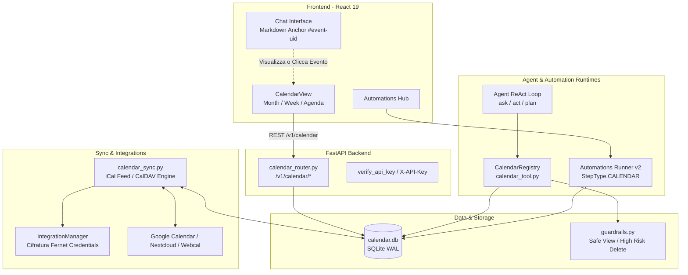

# Calendar Integration Architecture & Specifications

**Progetto:** `homelab-agent`  
**Data:** 24 Settembre 2026  
**Autore:** Homelab AI Engineering  
**Stato:** Specifica Tecnica & Architettura Attiva  
**Riferimenti:** [`docs/CALENDAR_INTEGRATION_RESEARCH.md`](file:///home/deggio/Desktop/coding/progetti/homelab/homelab-agent/docs/CALENDAR_INTEGRATION_RESEARCH.md), [`odysseus`](file:///home/deggio/Desktop/coding/progetti/homelab/odysseus)

---

## 1. Visione d'Insieme & Diagramma dei Componenti

L'integrazione del Calendario in `homelab-agent` trasforma l'assistente in un gestore temporale proattivo. L'architettura adotta un pattern **Local-First**: tutte le interrogazioni e modifiche avvengono su un database SQLite locale ad alte prestazioni, con sincronizzazione trasparente verso calendari esterni (Google Calendar, Nextcloud, CalDAV, iCal) gestita in background.



---

## 2. Modello Dati & Database SQLite (`/data/calendar.db`)

Il database è gestito tramite SQLite in modalità WAL (`PRAGMA journal_mode = WAL`) con busy timeout a 30 secondi per garantire concorrenza pulita tra Agent loop, chiamate REST del frontend e worker di sincronizzazione.

### 2.1 Tabella `calendars`
Contiene la definizione dei calendari logici registrati:

```sql
CREATE TABLE IF NOT EXISTS calendars (
    id TEXT PRIMARY KEY,
    name TEXT NOT NULL,
    color TEXT NOT NULL DEFAULT '#3b82f6',
    source TEXT NOT NULL DEFAULT 'local', -- 'local', 'caldav', 'google', 'ics_subscription'
    sync_url TEXT,
    account_id TEXT,                      -- FK logica verso integrations.id
    is_visible INTEGER NOT NULL DEFAULT 1,
    is_read_only INTEGER NOT NULL DEFAULT 0,
    last_synced_at TEXT,
    sync_error TEXT,
    created_at TEXT NOT NULL,
    updated_at TEXT NOT NULL
);
```

### 2.2 Tabella `calendar_events`
Rappresenta i singoli eventi o appuntamenti:

```sql
CREATE TABLE IF NOT EXISTS calendar_events (
    uid TEXT PRIMARY KEY,
    calendar_id TEXT NOT NULL REFERENCES calendars(id) ON DELETE CASCADE,
    summary TEXT NOT NULL,
    description TEXT DEFAULT '',
    location TEXT DEFAULT '',
    dtstart TEXT NOT NULL,                -- ISO-8601 (YYYY-MM-DDTHH:MM:SS)
    dtend TEXT NOT NULL,                  -- ISO-8601 (YYYY-MM-DDTHH:MM:SS)
    all_day INTEGER NOT NULL DEFAULT 0,
    is_utc INTEGER NOT NULL DEFAULT 1,
    rrule TEXT DEFAULT '',                -- RFC-5545 RRULE per eventi ricorrenti
    recurrence_exdates TEXT DEFAULT '[]', -- JSON array di date escluse
    category TEXT DEFAULT 'general',      -- 'meeting', 'personal', 'homelab', 'flight', 'reminder'
    importance TEXT DEFAULT 'normal',     -- 'low', 'normal', 'high', 'critical'
    status TEXT DEFAULT 'confirmed',      -- 'confirmed', 'tentative', 'cancelled'
    reminder_minutes INTEGER DEFAULT NULL,
    remote_href TEXT,                     -- URL o path remoto per sync CalDAV/Google
    remote_etag TEXT,                     -- ETag per evitare sovrascritture concorrenti
    sync_pending TEXT DEFAULT NULL,       -- 'create', 'update', NULL
    source_type TEXT DEFAULT 'manual',    -- 'manual', 'agent', 'automation', 'sync'
    source_id TEXT DEFAULT NULL,          -- run_id automazione o URL feed
    created_at TEXT NOT NULL,
    updated_at TEXT NOT NULL
);

CREATE INDEX IF NOT EXISTS idx_cal_events_dt ON calendar_events(dtstart, dtend);
CREATE INDEX IF NOT EXISTS idx_cal_events_cal ON calendar_events(calendar_id);
CREATE INDEX IF NOT EXISTS idx_cal_events_cat ON calendar_events(category);
```

### 2.3 Tabella `calendar_tombstones`
Traccia le cancellazioni avvenute in locale che devono essere propagate al server remoto:

```sql
CREATE TABLE IF NOT EXISTS calendar_tombstones (
    uid TEXT PRIMARY KEY,
    calendar_id TEXT NOT NULL,
    remote_href TEXT,
    deleted_at TEXT NOT NULL,
    sync_attempts INTEGER NOT NULL DEFAULT 0,
    last_error TEXT
);
```

---

## 3. Specifiche Strumenti Agent (`CalendarRegistry`)

L'agente ha accesso a strumenti granulari senza dipendere da mega-funzioni ambigue. Ogni tool è tipizzato con schema JSON conforme alle mode policies di `homelab-agent`.

| Nome Tool | Scopo | Parametri Principali | Rischio / Guardrail |
| :--- | :--- | :--- | :--- |
| `calendar_list_calendars` | Elenca calendari configurati | Nessuno | `SAFE_TOOLS` (`calendar.read`) |
| `calendar_list_events` | Ricerca eventi in un intervallo temporale | `start_date`, `end_date`, `calendar_id`, `category`, `query`, `limit` | `SAFE_TOOLS` (`calendar.read`) |
| `calendar_get_event` | Recupera dettagli completi evento | `event_id` (UID) | `SAFE_TOOLS` (`calendar.read`) |
| `calendar_create_event` | Crea uno o più eventi con deduplicazione | `summary`, `start_time`, `end_time`, `duration`, `location`, `description`, `category`, `calendar_id`, `events` (batch) | `SAFE_TOOLS` (`calendar.write`) |
| `calendar_update_event` | Aggiorna campi di un evento esistente | `event_id`, `summary`, `start_time`, `end_time`, `location`, `description`, `category`, `status` | `SAFE_TOOLS` (`calendar.write`) |
| `calendar_delete_event` | Rimuove un evento | `event_id` | `HIGH_RISK_TOOLS` (`calendar.destructive` — richiede conferma/approval) |
| `calendar_check_availability` | Calcola matematicamente gli slot liberi | `date`, `duration_minutes`, `start_hour`, `end_hour`, `calendar_id` | `SAFE_TOOLS` (`calendar.read`) |

### Caratteristiche Fondamentali mutuate da Odysseus
1. **Smart Deduplication:** Prima di inserire un nuovo evento, il tool esegue `find_existing_event(summary, dtstart)`. Se esiste già un evento identico, restituisce `status: "already_exists"` e il link all'evento esistente, prevenendo la moltiplicazione di eventi al riesame di email o task.
2. **Durate Naturali:** Gestione integrata di valori come `"30m"`, `"45min"`, `"1h"`, `"1h30m"`. Se `end_time` non è fornito, viene calcolato determinando il delta matematico senza chiedere calcoli aritmetici all'LLM.
3. **Ancore Markdown:** Ogni risposta di creazione/modifica include il tag Markdown `[Titolo](#event-<uid>)`.

---

## 4. Specifiche API REST (`/v1/calendar`)

Tutte le richieste richiedono autenticazione tramite header `X-API-Key`.

### Calendari
- `GET /v1/calendar/calendars` → Lista calendari con statistiche evento.
- `POST /v1/calendar/calendars` → Creazione di un calendario.
- `PUT /v1/calendar/calendars/{calendar_id}` → Modifica proprietà calendario (nome, colore, visibilità).
- `DELETE /v1/calendar/calendars/{calendar_id}` → Cancellazione calendario e dei suoi eventi a cascata.

### Eventi
- `GET /v1/calendar/events?start_date=...&end_date=...&calendar_id=...&query=...` → Ricerca ed estrazione eventi per la griglia o agenda.
- `GET /v1/calendar/events/upcoming?days=7` → Eventi imminenti nei successivi N giorni.
- `GET /v1/calendar/events/{event_id}` → Dettaglio evento singolo.
- `POST /v1/calendar/events` → Creazione evento con deduplicazione automatica.
- `PUT /v1/calendar/events/{event_id}` → Aggiornamento evento.
- `DELETE /v1/calendar/events/{event_id}` → Eliminazione evento (con generazione tombstone se remoto).

### Disponibilità & Sync
- `GET /v1/calendar/availability?start_time=...&duration=30m` → Controllo conflitti per uno slot orario.
- `POST /v1/calendar/sync` → Forza la sincronizzazione immediata dei feed e provider configurati.

---

## 5. Specifiche Frontend UI (`CalendarView.tsx`)

Il componente `CalendarView` è progettato in conformità al design system React 19 di `homelab-agent` (Dark Glassmorphism, Tailwind CSS, transizioni fluide):

```
┌─────────────────────────────────────────────────────────────────────────────┐
│                             CalendarView Header                             │
│ [ < ] [ Oggi ] [ > ]  Settembre 2026      [ Mese | Settimana | Agenda ]     │
│                                           [ + Nuovo Evento ]  [ ⟳ Sync ]   │
├─────────────────────┬───────────────────────────────────────────────────────┤
│ Sidebar Filtri      │ Griglia Calendario (Mese / Settimana / Agenda)        │
│                     │                                                       │
│ [ ] Ricerca rapida  │  Lun    Mar    Mer    Gio    Ven    Sab    Dom      │
│                     │  ────────────────────────────────────────────────     │
│ CALENDARI           │  [ 21 ] [ 22 ] [ 23 ] [ 24 ] [ 25 ] [ 26 ] [ 27 ]     │
│ [x] 🔵 Personale    │                       ┌─────────────┐                 │
│ [x] 🟣 Homelab      │                       │ 10:00 Team  │                 │
│                     │                       │ 15:00 Call  │                 │
│ CATEGORIE           │                       └─────────────┘                 │
│ [x] Meeting         │                                                       │
│ [x] Manutenzioni    │                                                       │
│ [x] Personale       │                                                       │
└─────────────────────┴───────────────────────────────────────────────────────┘
```

- **Integrazione Navigazione:** Aggiunta opzione `'calendar'` al selettore in [`ThreadList.tsx`](file:///home/deggio/Desktop/coding/progetti/homelab/homelab-agent/frontend/src/ThreadList.tsx) (`Chat Agent | Automations | Calendario`).
- **Modale Evento:** Form moderno per titolo, calendario di appartenenza, data e ora inizio/fine (o flag Tutto il giorno), luogo/URL meeting e note descrittive.
- **Responsività Mobile:** Vista compatta a riga di giorni con lista sottostante per schermi smartphone.
